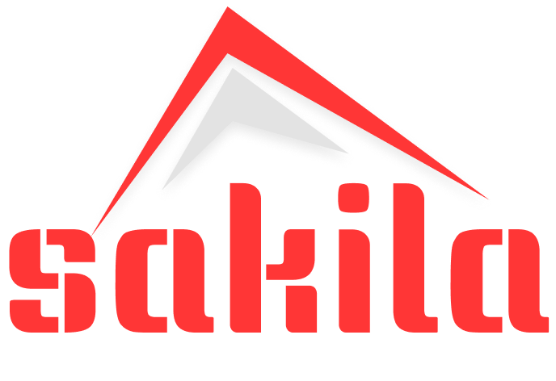

<br />
<div align="center">
  <a href="https://github.com/othneildrew/Best-README-Template">
    
  </a>

  <h3 align="center">Sakila Rest Api</h3>

  <p align="center">
    An awesome api Service Support different functions to use
    <br />
    <a href="https://github.com/othneildrew/Best-README-Template"><strong>Explore Api documentation »</strong></a>
    <br />
    <br />
  </p>
</div>

# About The Project
This Project is simple movie store provider and we built a differnet services for developer, Project try to rent movies to our customers and 
our main bussiness is rent those films so we provide rest and soap services to handle all simple crud operations from adding movie to rent it by
customer.

# Get Started
This is an example using our repository so follow those steps:

- Clone Repository

  ```sh
    git clone https://github.com/mohamedgomaa23722/Sakila-Rest.git
  ``` 

- Modifing Persistance.xml properities
  ```sh
    git clone https://github.com/mohamedgomaa23722/Sakila-Rest.git
  ``` 


# Technology Used
- Java
- Maven
- Jakarta
- Hibernate
- JAXB 
- MySQL
- Rest
-jersey
